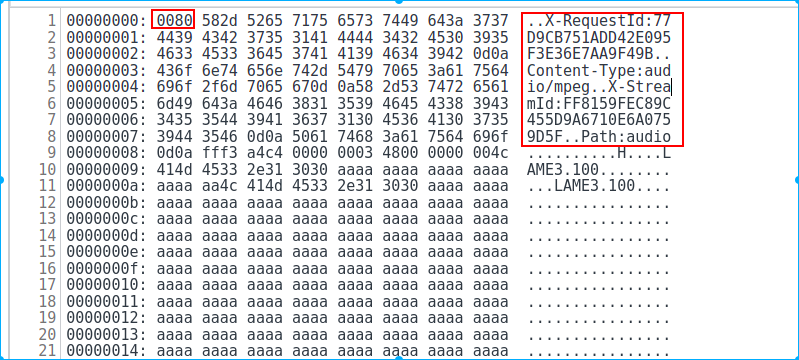
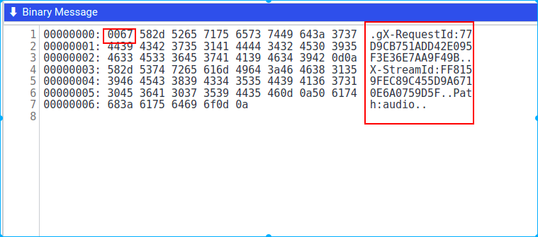

# 基于微软的免费的接近真人效果的TTS java实现

微软的tts语音合成发音接近真人。效果非常好，本仓库基于微软官方的demo实现了免费的tts示例，使用了java语言实现。
## 微软官方demo解析

微软的语音合成demo使用了websocket连接，一次合成会通过websocket想服务器发起三次请求，服务器通过若干个响应信息返回mp3格式音频
### 三次请求内容格式

#### 第一次请求内容：
```text
Path: speech.config
X-RequestId: 81C8781545B84F5394A3949B28716251
X-Timestamp: 2023-03-05T02:44:26.068Z
Content-Type: application/json

{"context":{"system":{"name":"SpeechSDK","version":"1.19.0","build":"JavaScript","lang":"JavaScript"},"os":{"platform":"Browser/Linux x86_64","name":"Mozilla/5.0 (X11; Linux x86_64) AppleWebKit/537.36 (KHTML, like Gecko) Chrome/102.0.0.0 Safari/537.36","version":"5.0 (X11; Linux x86_64) AppleWebKit/537.36 (KHTML, like Gecko) Chrome/102.0.0.0 Safari/537.36"}}}
```
> 通过第一次请求告知服务器当前客户端的sdk版本，操作浏览器版本等信息。请求路径为：speech.config

#### 第二次请求内容：
```text
Path: synthesis.context
X-RequestId: 81C8781545B84F5394A3949B28716251
X-Timestamp: 2023-03-05T02:44:26.069Z
Content-Type: application/json

{"synthesis":{"audio":{"metadataOptions":{"bookmarkEnabled":false,"sentenceBoundaryEnabled":false,"visemeEnabled":false,"wordBoundaryEnabled":false},"outputFormat":"audio-24khz-96kbitrate-mono-mp3"},"language":{"autoDetection":false}}}
```
>第二次请求告知服务器一些需要合成的音频的格式元信息

#### 第三次请求内容：
```text
Path: ssml
X-RequestId: 81C8781545B84F5394A3949B28716251
X-Timestamp: 2023-03-05T02:44:26.070Z
Content-Type: application/ssml+xml

<speak xmlns="http://www.w3.org/2001/10/synthesis" xmlns:mstts="http://www.w3.org/2001/mstts" xmlns:emo="http://www.w3.org/2009/10/emotionml" version="1.0" xml:lang="en-US"><voice name="zh-CN-XiaoxiaoNeural"><prosody rate="0%" pitch="0%">你好</prosody></voice></speak>
```
>第三次请求，告知服务器合成音频的字符串，生成的音频语言，说话的人物，说话的风格，说话的语速和语调

所有请求和响应通过X-RequestId标记为一次tts转换过程。
X-RequestId使用uuid无横杠的方式生成。

### 响应格式：
微软的一次tts过程的响应分成三次文本响应和若干次mp3的二进制消息体响应
#### 第一次文本响应：
```text
X-RequestId:81C8781545B84F5394A3949B28716251
Content-Type:application/json; charset=utf-8
Path:turn.start

{
  "context": {
    "serviceTag": "ce54b7da7fd74576a552e8632a098144"
  }
}
```
#### 第二次文本响应
```text
X-RequestId:81C8781545B84F5394A3949B28716251
Content-Type:application/json; charset=utf-8
Path:response

{"context":{"serviceTag":"ce54b7da7fd74576a552e8632a098144"},"audio":{"type":"inline","streamId":"69042AA81C3546EBA87B3A2ADD17C17B"}}
```
#### 第三次文本响应
```text
X-RequestId:81C8781545B84F5394A3949B28716251
Content-Type:application/json; charset=utf-8
Path:turn.end

{}
```
>当前两次文本响应后就会开始mp3的二进制消息体的响应,当所有mp3二进制消息体响应结束后会返回第三次文本响应的内容。 所以当接收到Path:turn.end的文本消息响应时表示mp3音频数据传输完成了。
## java代码实现
### 依赖
```xml
 <dependencies>
        <dependency>
            <groupId>junit</groupId>
            <artifactId>junit</artifactId>
            <version>4.13</version>
            <scope>test</scope>
        </dependency>
        <dependency>
            <groupId>org.java-websocket</groupId>
            <artifactId>Java-WebSocket</artifactId>
            <version>1.5.2</version>
        </dependency>
        <dependency>
            <groupId>org.slf4j</groupId>
            <artifactId>slf4j-api</artifactId>
            <version>1.7.32</version>
        </dependency>
        <dependency>
            <groupId>com.google.guava</groupId>
            <artifactId>guava</artifactId>
            <version>30.1-jre</version>
        </dependency>
        <dependency>
            <groupId>org.projectlombok</groupId>
            <artifactId>lombok</artifactId>
            <scope>provided</scope>
            <version>1.18.16</version>
        </dependency>

    </dependencies>
```
> 使用Java-WebSocket作为websocket的客户端
### 创建websocket连接
```java
public class MTTS{
    private void init() throws URISyntaxException, InterruptedException {
        //使用uuid生成X-ConnectionId
        String uuid = UUID.randomUUID().toString().replace("-", "").toUpperCase();
        //拼接uuid生成websocket请求地址
        String urlStr =
                "wss://eastus.api.speech.microsoft.com/cognitiveservices/websocket/v1?TrafficType=AzureDemo&Authorization=bearer%20undefined&X-ConnectionId="
                        + uuid;
        
        log.info("ws url {}", urlStr);
        wsClient = new WebSocketClient(new URI(urlStr)) {
            @Override
            public void onOpen(ServerHandshake serverHandshake) {
                log.info("ws client is open");
                isRely = true;
            }

            @Override
            public void onMessage(ByteBuffer bytes) {
                //接收mp3片段的二进制消息
                AudioMp3Part part = new AudioMp3Part(bytes);
                String xRequestId = part.getXRequestId();
                lisentHashMap.get(xRequestId).mp3Part(part);
            }

            @Override
            public void onMessage(String message) {
                //接收的文本消息
                AudioMessage audioMessage = new AudioMessage(message);
                if ("turn.end".equals(audioMessage.getPath())) {
                    lisentHashMap.get(audioMessage.getXRequestId()).end(message);
                }
            }

            @Override
            public void onClose(int i, String s, boolean b) {
                System.out.println("onclose:" + s);
                isRely = false;
            }

            @Override
            public void onError(Exception e) {
                log.warn("onError", e);
            }
        };
        //必须添加origin这个请求头，否则会被微软屏蔽
        wsClient.addHeader("Origin", "https://azure.microsoft.com");

        wsClient.addHeader("User-Agent",
                "Mozilla/5.0 (X11; Ubuntu; Linux x86_64; rv:102.0) Gecko/20100101 Firefox/102.0");
        wsClient.addHeader("Accept", "*/*");
        wsClient.addHeader("Accept-Language",
                "zh-CN,zh;q=0.8,zh-TW;q=0.7,zh-HK;q=0.5,en-US;q=0.3,en;q=0.2");
        wsClient.addHeader("Upgrade", "websocket");
        //连接服务器
        this.wsClient.connect();
    }
}
```
> 请求的X-ConnectionId使用uuid去横杠随机生成，hender头一定要记得添加"Origin", "https://azure.microsoft.com"。否则微软会拒绝服务
> public void onMessage(ByteBuffer bytes)用于监听接收服务器返回的mp3二进制消息
> public void onMessage(String bytes)用于监听接收服务器返回的文本消息

### java实现三次请求
```java
public class Sender{
    private TTSConfig ttsConfig=new TTSConfig();
    private void sendText(WebSocketClient client, String text) {
        String requestID = UUID.randomUUID().toString().replace("-", "").toUpperCase();
        send1(client,requestID);
        send2(client,requestID);
        send3(client,requestID,text);
    }
    private void send1(WebSocketClient client, String requestID) {
        String timestamp = dateFormat.format(new Date());
        //        String test= "Path: speech.config\r\nX-RequestId: "+requestID+"\r\nX-Timestamp: "+timestamp+"\r\nContent-Type: application/json\r\n\r\n{\"context\":{\"system\":{\"name\":\"SpeechSDK\",\"version\":\"1.19.0\",\"build\":\"JavaScript\",\"lang\":\"JavaScript\",\"os\":{\"platform\":\"Browser/Linux x86_64\",\"name\":\"Mozilla/5.0 (X11; Linux x86_64; rv:78.0) Gecko/20100101 Firefox/78.0\",\"version\":\"5.0 (X11)\"}}}}";

        String test =
                "Path: speech.config\r\n" + "X-RequestId: " + requestID + "\r\n" + "X-Timestamp: "
                        + timestamp + "\r\n" + "Content-Type: application/json\r\n" + "\r\n"
                        + "{\"context\":{\"system\":{\"name\":\"SpeechSDK\",\"version\":\"1.19.0\",\"build\":\"JavaScript\",\"lang\":\"JavaScript\"},\"os\":{\"platform\":\"Browser/Linux x86_64\",\"name\":\"Mozilla/5.0 (X11; Ubuntu; Linux x86_64; rv:102.0) Gecko/20100101 Firefox/102.0\",\"version\":\"5.0 (X11)\"}}}";
        log.debug("send1:{}", test);
        client.send(test);
    }

    private void send2(WebSocketClient client, String requestID) {
        String timestamp = dateFormat.format(new Date());
        //        String test= "Path: synthesis.context\r\nX-RequestId: "+requestID+"\r\nX-Timestamp: "+timestamp+"\r\nContent-Type: application/json\r\n\r\n{\"synthesis\":{\"audio\":{\"metadataOptions\":{\"sentenceBoundaryEnabled\":false,\"wordBoundaryEnabled\":false},\"outputFormat\":\"audio-24khz-160kbitrate-mono-mp3\"}}}";
        String test = "Path: synthesis.context\r\n" + "X-RequestId: " + requestID + "\r\n"
                + "X-Timestamp: " + timestamp + "\r\n" + "Content-Type: application/json\r\n"
                + "\r\n"
                + "{\"synthesis\":{\"audio\":{\"metadataOptions\":{\"bookmarkEnabled\":false,\"sentenceBoundaryEnabled\":false,\"visemeEnabled\":false,\"wordBoundaryEnabled\":false},\"outputFormat\":\"audio-24khz-96kbitrate-mono-mp3\"},\"language\":{\"autoDetection\":false}}}";
        log.debug("send2:{}", test);
        client.send(test);
    }

    private void send3(WebSocketClient client, String requestID, String text) {
        String timestamp = dateFormat.format(new Date());
        String test = "Path: ssml\r\n" + "X-RequestId: " + requestID + "\r\n" + "X-Timestamp: "
                + timestamp + "\r\n" + "Content-Type: application/ssml+xml\r\n" + "\r\n"
                + "<speak xmlns=\"http://www.w3.org/2001/10/synthesis\" xmlns:mstts=\"http://www.w3.org/2001/mstts\" xmlns:emo=\"http://www.w3.org/2009/10/emotionml\" version=\"1.0\" xml:lang=\""+ttsConfig.getLanguage().getCode()+"\"><voice name=\""+ttsConfig.getVoice().getCode()+"\"><mstts:express-as style=\""+ttsConfig.getVoiceStyle().getCode()+"\" ><prosody rate=\"0%\" pitch=\"0%\">"
                + text + "</prosody></mstts:express-as></voice></speak>";
        log.debug("send3:{}", test);
        client.send(test);
    }
}
```

### 文本响应体解析
```java
public class AudioMessage {
    private String sourceMsg;
    private String xRequestId;
    private String contentType;
    private String path;

    public AudioMessage(String msg) {
        this.sourceMsg = msg;
        initByByte(msg.getBytes(StandardCharsets.UTF_8));
    }

    private void initByByte(byte[] bytes) {
        try {
            BufferedReader br =
                    new BufferedReader(new InputStreamReader(new ByteArrayInputStream(bytes)));
            String line;
            while ((line = br.readLine()) != null) {
                if (!line.trim().equals("")) {
                    String[] split = line.split(":");
                    if ("X-RequestId".equals(split[0])) {
                        this.xRequestId = split[1];
                    } else if ("Content-Type".equals(split[0])) {
                        this.contentType = split[1];
                    } else if ("Path".equals(split[0])) {
                        this.path = split[1];
                    } else {
                        continue;
                    }
                } else {
                    continue;
                }
            }
        } catch (Exception e) {
            e.printStackTrace();
        }
    }
}
```
### mp3二进制响应头解析
微软会将一个合成mp3音频分割成几部分通过websocket返回，一次二进制响应消息返回部分mp3数据。

```text
X-RequestId:77D9CB751ADD42E095F3E36E7AA9F49B
Content-Type:audio/mpeg
X-StreamId:FF8159FEC89C455D9A6710E6A0759D5F
Path:audio

```
以上文本信息（算上换行符\r\n）一共有128个字节，0080十六进制表示十进制的128

```text
X-RequestId:77D9CB751ADD42E095F3E36E7AA9F49B
X-StreamId:FF8159FEC89C455D9A6710E6A0759D5F
Path:audio

```
以上文本信息（算上换行符\r\n）一共有103个字节，0067十六进制表示十进制的103
所以猜测响应体包括3部分：
1. 2个字节的文本大小说明
2. 文本数据
3. mp3数据 

通过分析发现： 二进制响应体总共1570个字节，前两个字节的十六进制是0080，转换十进制后就是128，说明接下去的128字节是文本说明信息，之后的1440个字节就是mp3片段的mp3数据

解析mp3片段代码:
```java

@Getter
public class AudioMp3Part {
    private byte[] bodyByte;
    private byte[] mp3Part;
    private short headSize;
    private AudioMp3MessageHead head;
    private static int i = 0;

    public AudioMp3Part(ByteBuffer buffer) {
        bodyByte = buffer.array();
        if (bodyByte == null || bodyByte.length == 0) {
            throw new RuntimeException("body bytes is null");
        }
        //响应体的前两个字节用于说明接下去的多少个字节是文本消息，文本消息结束就是mp3字节数据，如:128,则表示，前两个字节后的128个字节是文本消息，之后的数据就是mp3字节数据
        headSize = buffer.getShort(0);
        byte[] headBytes = Arrays.copyOfRange(bodyByte, 2, headSize + 2);
        if (headBytes == null || headBytes.length == 0) {
            throw new RuntimeException("head bytes is null");
        }
        head = new AudioMp3MessageHead(headBytes);
        //跳过前两个字节，和文本消息的字节，剩下的字节就是mp3的二进制字节数据体片段
        mp3Part = Arrays.copyOfRange(bodyByte, headSize + 2, bodyByte.length);
    }

    public String getXRequestId() {
        return head.getXRequestId();
    }


}
```
### 合并mp3片段：
```java
public class AudioMp3 {
    private final ArrayList<AudioMp3Part> parts = new ArrayList<>();
    private String requestId;
    private String streamId;

    public byte[] getMp3Byte() {
        byte[] b = new byte[0];
        //将所有mp3片段数据合并成一个完整的mp3文件
        for (AudioMp3Part b1 : parts) {
            b = Bytes.concat(b, b1.getMp3Part());
        }
        return b;
    }

    public void add(AudioMp3Part part) {
        parts.add(part);
    }


}
```
以上就是免费的tts java完整代码请查看：[https://github.com/nathanhex/mstts-demo.git](https://github.com/nathanhex/mstts-demo.git)
**完**