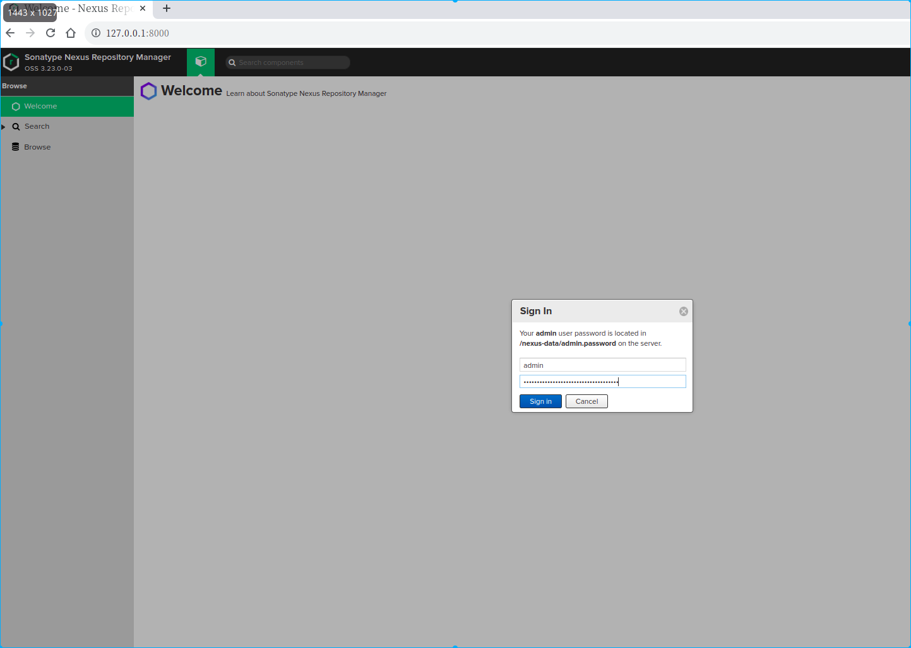
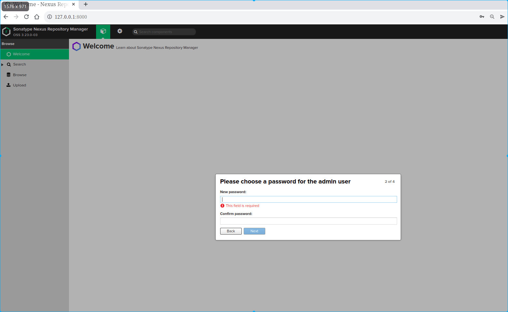
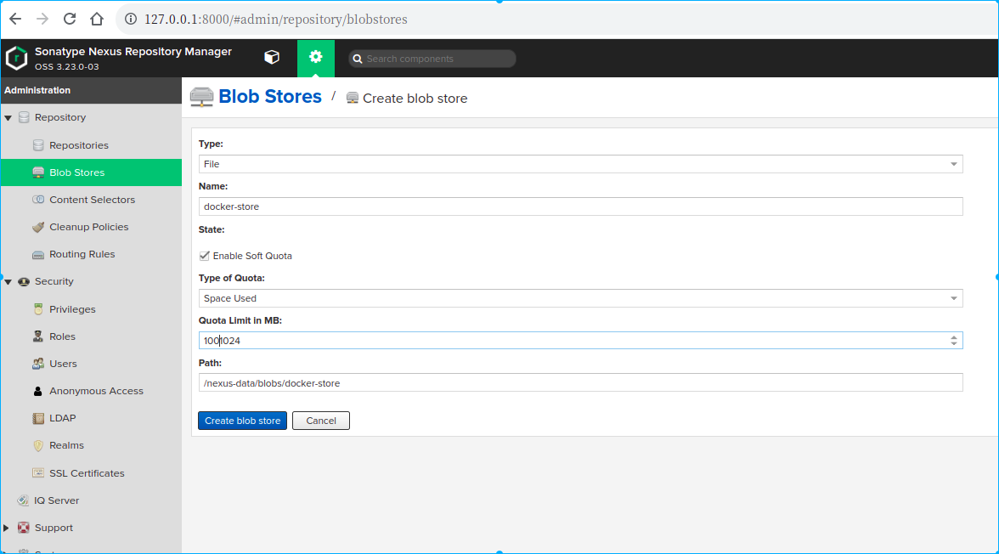
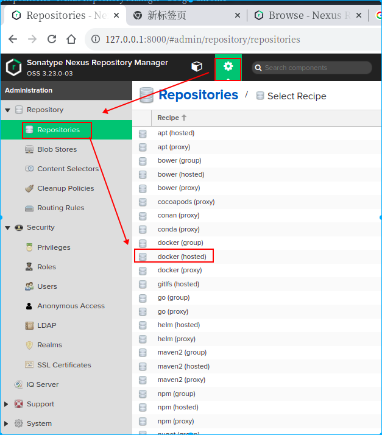
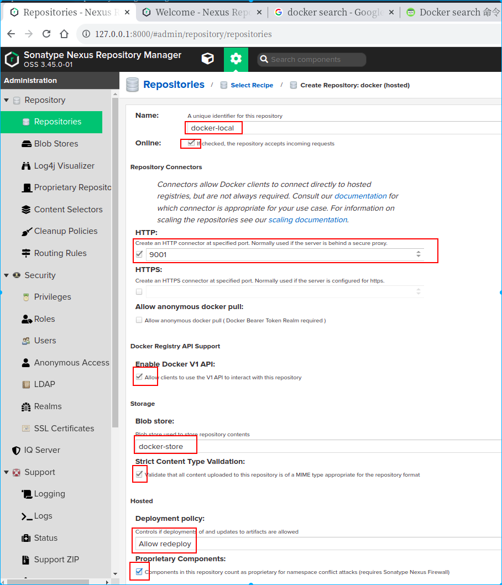
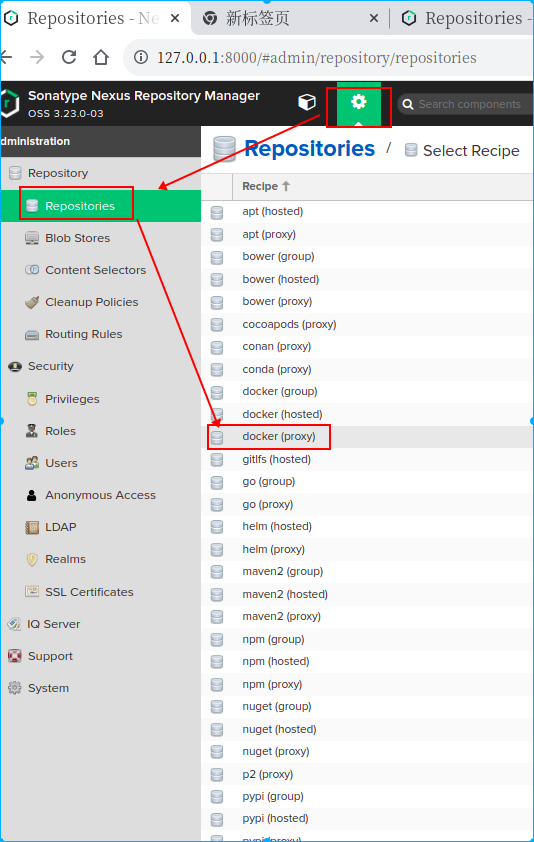
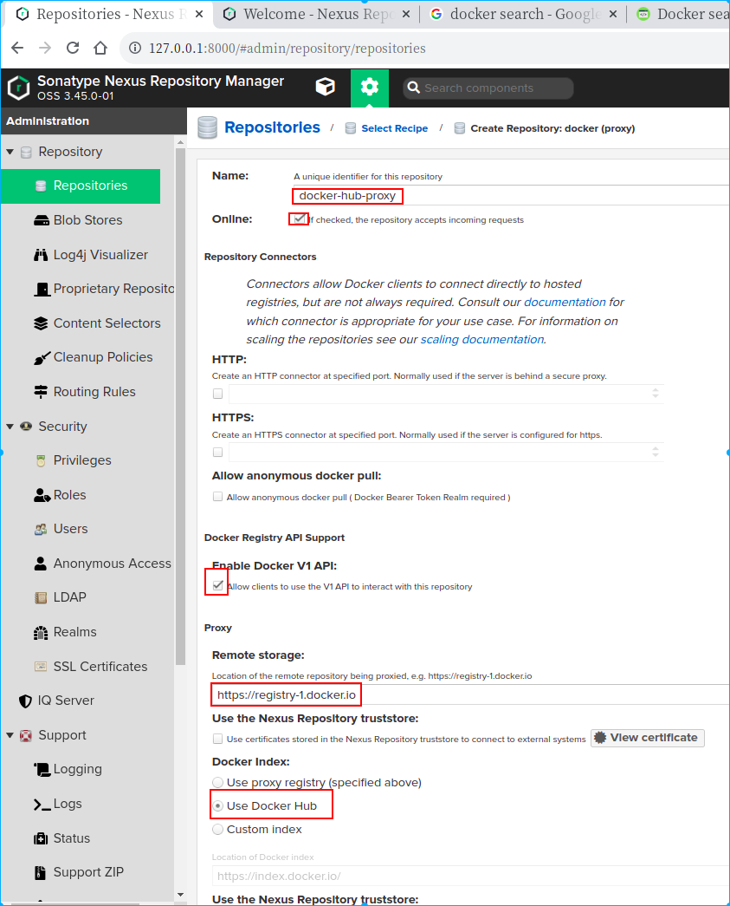
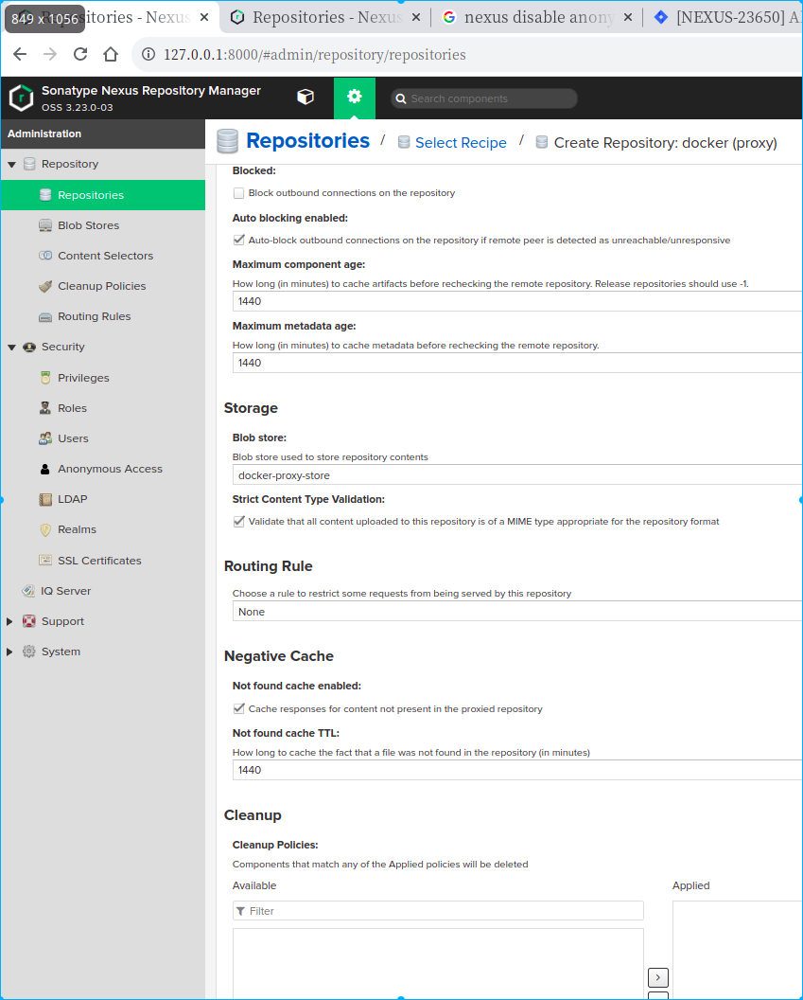
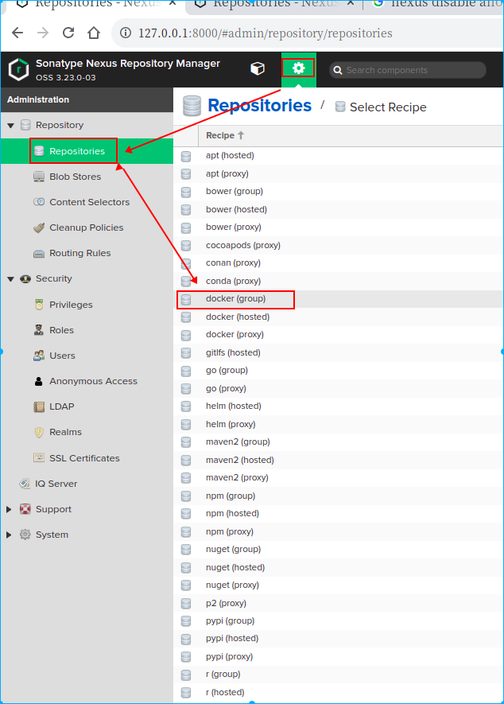
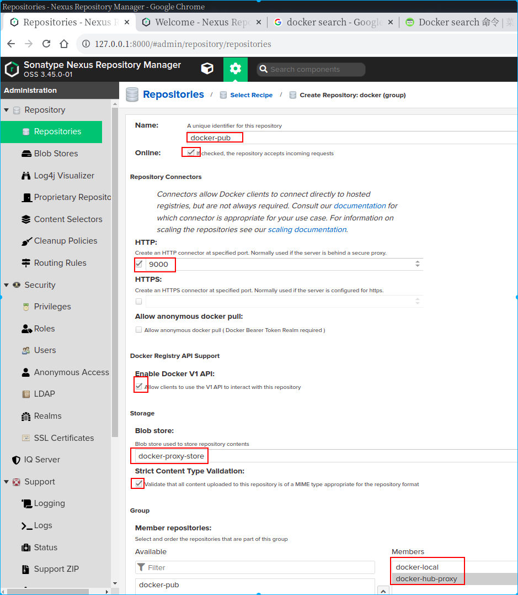

# 安装
此教程帮助搭建在kubernetes集群中安装nexus。
选择nexus的理由：
1. 轻松管理所有包裹
2. 存储和分发具有本机包管理器兼容性的组件
3. 支持 Java/Maven、npm、NuGet、PyPI、RubyGems、CocoaPods 等生态系统
4. 分发打包和容器化的应用程序，例如 Docker、Helm、Yum 和 APT
5. 与流行的 IDE 和 CI 兼容，例如 Eclipse、IntelliJ、Visual Studio、Jenkins

安装依赖：安装kuberneter集群
## 安装nexus主程序

```yaml
apiVersion: v1
kind: Namespace
metadata:
  name: nexus
---
apiVersion: v1
kind: PersistentVolumeClaim
metadata:
  name: nexus-pvc
spec:
  storageClassName: nfs-storage
  accessModes:
    - ReadWriteMany
  resources:
    requests:
      storage: 1024Mi
---
apiVersion: apps/v1
kind: Deployment
metadata:
  labels:
    app: nexus3
  name: nexus3
spec:
  replicas: 1
  selector:
    matchLabels:
      app: nexus3
  template:
    metadata:
      labels:
        app: nexus3
    spec:
      containers:
        - name: nexus3
          image: sonatype/nexus3:3.23.0
          ports:
            - containerPort: 8081
              protocol: TCP
              name: web
            - containerPort: 9000
              protocol: TCP
              name: docker-gruop
            - containerPort: 9001
              protocol: TCP
              name: docker-host
            - containerPort: 9002
              protocol: TCP
              name: docker-anon
          volumeMounts:
            - name: nexus-data
              mountPath: /nexus-data
      volumes:
        - name: nexus-data
          persistentVolumeClaim:
            claimName: nexus-pvc
---
kind: Service
apiVersion: v1
metadata:
  labels:
    app: nexus3
  name: nexus3
spec:
  type: ClusterIP
  ports:
    - name: docker-gruop
      port: 9000
      targetPort: 9000
      protocol: TCP
    - name: docker-host
      port: 9001
      targetPort: 9001
      protocol: TCP
    - name: docker-anon
      port: 9002
      targetPort: 9002
      protocol: TCP
    - name: web
      port: 80
      targetPort: 8081
      protocol: TCP
  selector:
    app: nexus3
---
kind: Service
apiVersion: v1
metadata:
  labels:
    app: nexus3
  name: docker-private
spec:
  type: ClusterIP
  ports:
    - name: docker-host
      port: 80
      targetPort: 9001
      protocol: TCP
  selector:
    app: nexus3
---
kind: Service
apiVersion: v1
metadata:
  labels:
    app: nexus3
  name: docker-public
spec:
  type: ClusterIP
  ports:
    - name: docker-gruop
      port: 80
      targetPort: 9000
      protocol: TCP
  selector:
    app: nexus3

```

##  安装nexus ingress

```yaml
---
# nexus web访问域名
apiVersion: networking.k8s.io/v1beta1
kind: Ingress
metadata:
  name: nexus-web-ingress
  annotations:
    cert-manager.io/cluster-issuer: letsencrypt-dns-prod
spec:
  rules:
    - host: nexus.xxx.xxx
      http:
        paths:
          - path: /
            backend:
              serviceName: nexus3
              servicePort: 80
  tls:
    - hosts:
      - nexus.xxx.xxx
      secretName: nexus-xxx.xxx-ingress-secret
---
#nexus docker镜像仓库访问域名
apiVersion: networking.k8s.io/v1beta1
kind: Ingress
metadata:
  name: nexus-docker-ingress
  annotations:
    cert-manager.io/cluster-issuer: letsencrypt-dns-prod
    nginx.ingress.kubernetes.io/proxy-body-size: 0m
spec:
  rules:
    - host: docker-private-nexus.xxx.xxx
      http:
        paths:
          - backend:
              serviceName: docker-public
              servicePort: 80
            path: /
    - host: docker-push.xxx.xxx
      http:
        paths:
          - backend:
              serviceName: docker-private
              servicePort: 80
            path: /
  tls:
    - hosts:
        - docker-private-nexus.xxx.xxx
      secretName: docker-private-nexus-xxx.xxx-ingress-secret
    - hosts:
        - docker-push.xxx.xxx
      secretName: docker-push-xxx.xxx-ingress-secret
```

说明：

1.nexus.xxx.xxx用于访问nexus的web管理后台界面

2.docker-private-nexus.xxx.xxx用于访问docker-gruop镜像仓库

3.docker-push.xxx.xxx用于推送docker镜像

！！！注意：

1.由于nexus开源版本的限制不能在docker-gruop类型的仓库之间push镜像，docker-private-nexus.xxx.xxx指向的是docker-gruop类型的仓库只能用于拉取镜像，无法推送镜像，所以只能单独配置一个域名docker-push.xxx.xxx进行推送docker镜像。商业版本的nexus无此限制。

2.自建的ingress一般使用ingress-nginx进行外部服务发布，为了避免使用域名推送docker镜像时出现http 415错误响应码，需要在ingress的配置"nginx.ingress.kubernetes.io/proxy-body-size: 0m"，表示可以上传无限大的文件。

3.如果ci/cd流水线使用了kubernetes的docker in docker。则建议使用docker-public.nexus：和docker-private.nexus这两个服务名访问docker镜像仓库可以提升访问性能

## 查看安装情况

```shell
➜  kubectl get service -n nexus
NAME             TYPE        CLUSTER-IP      EXTERNAL-IP   PORT(S)                             AGE
docker-private   ClusterIP   10.96.28.129    <none>        80/TCP                              8m41s
docker-public    ClusterIP   10.96.112.208   <none>        80/TCP                              8m41s
nexus3           ClusterIP   10.96.198.142   <none>        9000/TCP,9001/TCP,9002/TCP,80/TCP   8m42s
➜  kubectl get pvc -n nexus
NAME        STATUS   VOLUME                                     CAPACITY   ACCESS MODES   STORAGECLASS   AGE
nexus-pvc   Bound    pvc-f07bcba4-973c-402a-808b-4674b91ba376   1Gi        RWX            fs-storage     96s
➜  kubectl get ingress -n nexus 
NAME                                          HOSTS                                 ADDRESS                       PORTS     AGE
docker-private-xxx.xxx-ingress       docker-private.xxx.xxx       192.168.0.102,192.168.0.132   80, 443   667d
docker-repo-dev-xxx.xxx-ingress      docker-repo-dev.xxx.xxx      192.168.0.102,192.168.0.132   80, 443   667d
nexus-dev-xxx.xxx-ingress            nexus-dev.xxx.xxx            192.168.0.102,192.168.0.132   80, 443   667d
➜  kubectl get pod -n nexus    
NAME                      READY   STATUS    RESTARTS   AGE
nexus3-558659d554-kchl6   1/1     Running   0          7m44s
```

以上信息表面nexus安装成功，可以进行配置

# 配置

## 首次登录



首次登录用户名为：admin

用户密码在**/nexus-data/admin.password文件中**



首次登录需要有几个初始化任务

1.修改登录密码

2.配置是否激活匿名访问，建议禁用匿名访问

## 配置docker镜像单独的blob存储



开启软配额通知，此处设置使用空间达到100gb的时候告警

## 创建docker hosted类型仓库

企业自行打包的docker镜像存放在该仓库

Repository>Repositories>create repository





配置说明：

name: docker-local

仓库名称，可根据情况自行设置

Repository Connectors http: 9001

http仓库连接器，设置后，nexus会在当前主机开启一个服务，监听和接受9001端口的请求，该端口的请求将被转发到该仓库，这样docker的客户端就可以通过“nexus域名:9001”直接访问到该仓库

enable docker v1 api: true

如果需要使用该仓库的docker search 功能则必须开启 v1 api

blob store: docker-store

该选项配置docker镜像存放的blob store，建议选择刚刚创建好的名称为docker-store的blob store，建议每个仓库创建一个blob store,这样的各个仓库的存储相互独立，一个仓库存储挂了不至于影响另一个仓库

strict content type validation: true

激活验证上传文件的mime是否符合当前仓库的格式

deployment policy: Allow redeploy

允许重新发布，表示允许同一个版本号的镜像进行覆盖更新

proprletary components： true

设置为专有组件库可以防止命名空间混淆攻击，查看详细说明:[__命名空间混淆攻击__](https://help.sonatype.com/fw/preventing-namespace-confusion)


## 创建docker proxy仓库

docker hub是docker的官方镜像仓库，代理该仓库可大大提高镜像的访问速度,**配置代理仓库关键在于remote storage和docker index两个参数的配置，这两个参数配置正确可以有效避免遇到各种bug**








name： docker-hub-proxy

repository connectors: 一般代理的仓库会被包含到一个gruop类型的仓库，所有一般不用配置connectors用于直接访问该仓库

allow anonymous docker pull: false

enable docker v1 api: true

一般建议开启，如果需要使用该仓库的docker search 功能则必须开启 v1 api，如果该仓库禁用v1版本api那么将该仓库加入到其他group的组仓库时，该组仓库也无法搜索到当前仓库的内容。

remote storage:  [__https://registry-1.docker.io__](https://registry-1.docker.io)

docker index: use docker hub

auto blocking enabled: true

maximum component age: 1440

maximum metadata age: 1440

blob store: docker-proxy-store

strict content type validation: true

not found cache enable: true

not found cache ttl: 1440

## 创建docker group仓库

用于聚合多个docker镜像仓库提供统一的仓库地址





name: docker-pub

Repository Connectors http: 9000

allow aninymous docker pull: false

enable docker v1 api: true

如果需要使用该仓库的docker search 功能则必须开启 v1 api，

blob store: docker-proxy-store

strict content type validation: false

member repositories>members: docker-local ,docker-hub-proxy

# 3.常见问题

- docker默认使用https，如果需要使用http协议访问docker仓库需要配置

**完**