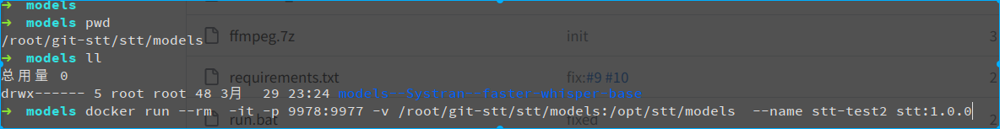
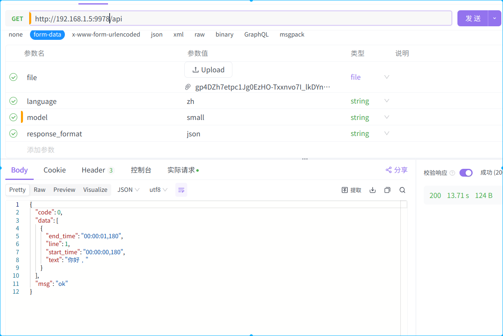

# openai whipser开源的语音转文字服务
微信公众号下线了语音消息转文字能力，不再返回Recongnition字段。讯飞的语音识别有额度限制，
得知Openai开源的whipser语音识别能力非常强悍，于是决定自己搭建语音识别服务。
# 服务搭建
whipser本身无法直接提供接口给用户使用，github上有个项目[jianchang512-stt](https://github.com/jianchang512/stt)集成了whipser并提供了http的api接口给用户使用。
[jianchang512-stt](https://github.com/jianchang512/stt)有详细的安装教程，不复杂，但是需要保证网络环境通畅，需要下载的依赖有7-8gb。

基于[jianchang512-stt](https://github.com/jianchang512/stt)打了一个docker镜像，包含的base模型，方便docker用户运行stt服务。不想折腾可以直接使用我打的docker镜像运行。大小有7-8g。

## 运行默认base模型的stt服务
```shell
docker run -d -p 9977:9977 nathanhuang/stt:latest 
```
## 运行openai whisper的small/medium/large-v3等模型
从此网友提供的[全部模型下载地址](https://github.com/jianchang512/stt/releases/tag/0.0)下载模型。

下载并解压的模型到/root/git-stt/stt/models/，挂载模型到容器/opt/stt/models/挂载点：
```shell
docker run --rm  -it -p 9977:9977 -v /root/git-stt/stt/models/:/opt/stt/models/  --name stt stt:latest
```

`/root/git-stt/stt/models/`模型存放在本机的位置

`/opt/stt/models/`是容器的模型挂载点，将下载到本机的模型挂载到容器内，让容器提供small/medium/large-v3等模型的语音转文字能力
## api请求
```shell
curl --location --request GET 'http://192.168.1.5:9978/api' \
--form 'file=@"/tmp/gp4DZh7etpc1Jg0EzHO-Txxnvo7I_lkDYnepnAF610BHyW6_RS-qTKyX97xqlXv58274138825450053698.mp3"' \
--form 'language="zh"' \
--form 'model="small"' \
--form 'response_format="json"'
```

# 相关连接
[stt的docker镜像制作](https://github.com/nathanhex/stt-docker)
[openai whipser http 接口服务项目](https://github.com/jianchang512/stt)

**完**