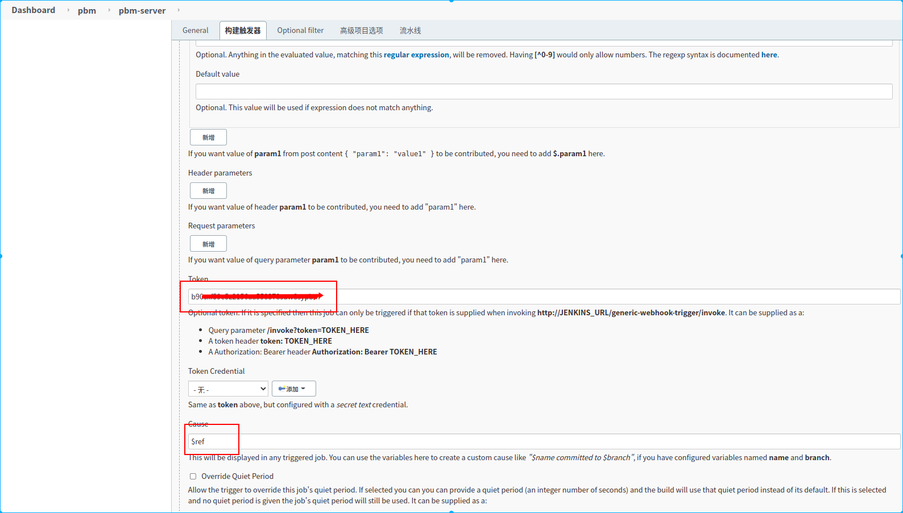

# jenkins是什么？

Jenkins是一款开源 CICD 软件，用于自动化各种任务，包括构建、测试和部署软件。

Jenkins 支持各种运行方式，可通过系统包、Docker 或者通过一个独立的 Java 程序。

# why jenkins kubernetes

持续构建与发布是我们日常工作中必不可少的一个步骤，jenkins需要的资源有时候单台机器不一定能满足全公司的构建发布需求，所以使用一般需要Jenkins 集群来搭建符合需求的 CI/CD 流程，然而传统的 Jenkins Slave 一主多从方式会存在一些痛点:

痛点1：主 Master 发生单点故障时，整个流程都不可用了；

痛点2：每个 Slave 的配置环境不一样，来完成不同语言的编译打包等操作，但是这些差异化的配置导致管理起来非常不方便，维护起来也是比较费劲；

痛点3：资源分配不均衡，有的 Slave 要运行的 job 出现排队等待，而有的 Slave 处于空闲状态；

痛点4：最后资源有浪费，每台 Slave 可能是实体机或者 VM，当 Slave 处于空闲状态时，也不会完全释放掉资源。

# 如何解决传统jenkins 集群问题：

1.kubernetes deployment可以检测到jenkins master实例挂掉后在新的节点上重启一个新的jenkins master示例，重启的这段时间内jenkins还是无法使用，这个方案暂时不完美，但是可以通过冷备的方式解决master单点故障问题。

2.由docker提供slave节点需要的系统配置，确保了按需提供slave节点的软件环境，在pipline里声明任务所需的系统和软件环境，非常自由方便

3.slave节点由kubernetes管理，按需创建，使用完slave节点pod就销毁了，资源释放给其他任务使用，不会出现slave节点资源闲置浪费或等待排队的情况

# kubernetes集群安装

## 动态存储

### 安装nfs

在主机192.168.0.105的centos系统下安装nfs：

```shell
#安装nfs
sudo yum install nfs-utils

#创建nfs数据文件夹夹
sudo mkdir /data
sudo chmod 755 /data
#nfs配置
sudo echo  "/data/    *(rw,sync,no_root_squash,no_all_squash)" >> /etc/exports
#启动nfs相关服务
 sudo systemctl enable rpcbind
sudo systemctl enable nfs
#可选操作，如果开启了防火墙，则需要使用如下命令开放nfs相关服务的端口
sudo firewall-cmd --zone=public --permanent --add-service={rpc-bind,mountd,nfs}
sudo firewall-cmd --reload

```

nfs配置说明

1. `/data`: 共享目录位置。

1. `*`: 客户端 IP 范围`*` 代表所有，即没有限制。`192.168.0.0/24`客户端 IP 范围在192.168.0.0-192.168.255.255之间的ip可以访问

1. `rw`: 权限设置，可读可写。

1. `sync`: 同步共享目录。

1. `no_root_squash`: 可以使用 root 授权。

1. `no_all_squash`: 可以使用普通用户授权。


### 安装StorageClass使用nfs提供动态存储卷

- 说明：假设nfs安装在192.168.0.105主机上，以下创建nfs-storage.yaml文件,内容如下:

```yaml
---
apiVersion: v1
kind: ServiceAccount
metadata:
  name: nfs-provisioner
---
kind: ClusterRole
apiVersion: rbac.authorization.k8s.io/v1
metadata:
  name: nfs-provisioner-runner
rules:
  -  apiGroups: [""]
     resources: ["persistentvolumes"]
     verbs: ["get", "list", "watch", "create", "delete"]
  -  apiGroups: [""]
     resources: ["persistentvolumeclaims"]
     verbs: ["get", "list", "watch", "update"]
  -  apiGroups: ["storage.k8s.io"]
     resources: ["storageclasses"]
     verbs: ["get", "list", "watch"]
  -  apiGroups: [""]
     resources: ["events"]
     verbs: ["watch", "create", "update", "patch"]
  -  apiGroups: [""]
     resources: ["services", "endpoints"]
     verbs: ["get","create","list", "watch","update"]
  -  apiGroups: ["extensions"]
     resources: ["podsecuritypolicies"]
     resourceNames: ["nfs-provisioner"]
     verbs: ["use"]
---
kind: ClusterRoleBinding
apiVersion: rbac.authorization.k8s.io/v1
metadata:
  name: run-nfs-provisioner
subjects:
  - kind: ServiceAccount
    name: nfs-provisioner
    namespace: default
roleRef:
  kind: ClusterRole
  name: nfs-provisioner-runner
  apiGroup: rbac.authorization.k8s.io
---
kind: Deployment
apiVersion: apps/v1
metadata:
  name: nfs-client-provisioner
  # namespace: default
  labels:
    app: nfs-client-provisioner
spec:
  selector:
    matchLabels:
      app: nfs-client-provisioner
  replicas: 1
  strategy:
    type: Recreate
  template:
    metadata:
      labels:
        app: nfs-client-provisioner
    spec:
      serviceAccountName: nfs-provisioner
      containers:
        -  name: nfs-client-provisioner
           image: quay.io/external_storage/nfs-client-provisioner:v3.1.0-k8s1.11
           volumeMounts:
             -  name: nfs-client-root
                mountPath:  /persistentvolumes
           env:
             -  name: PROVISIONER_NAME
                value: fuseim.pri/nfs
             -  name: NFS_SERVER
                value:  192.168.0.105
             -  name: NFS_PATH
                value: /data/
      volumes:
        - name: nfs-client-root
          nfs:
            server:  192.168.0.105
            path: /data/
---
apiVersion: storage.k8s.io/v1
kind: StorageClass
metadata:
  name: nfs-storage
  # namespace: default
  annotations:
    storageclass.kubernetes.io/is-default-class: true
# 存储分配器，和PROVISIONER_NAME环境变量一直，其他可选值可以参看：https://kubernetes.io/zh/docs/concepts/storage/storage-classes/#%e4%bb%8b%e7%bb%8d
provisioner: fuseim.pri/nfs
reclaimPolicy: Retain

```

- 执行命令：

```shell
kubectl apply  -f nfs-storage.yaml
```

yaml说明：

> 1.创建了名称为nfs-provisioner的serviceAccount,

> 2.创建了名称为nfs-provisioner-runner的cluterRole，指定该角色的资源权限用于访问集群的pv和pvc，storageclasses等kubernetes资。

> 3.创建名称为run-nfs-provisioner的ClusterRoleBinding，用于绑定serviceaccount和clusterrole,将该nfs-provisioner-runner角色赋给nfs-provisioner的serviceAccount，使该sa可以访问改角色指定的资源

> 4.创建nfs-client-provisioner的deployment，运行nfs的客户端应用，挂载了nsf到pod内部的 /persistentvolumes目录，通过环境变量NFS_SERVER来指定nfs的服务器地址为192.168.0.105，NFS_PATH来指定nfs服务器路径为：/nfs，PROVISIONER_NAME指定一个名称用于绑定给StorageClass，由他该来提供nfs的动态存储给其他pod使用。

> 5.创建nfs-storage的StorageClass，通过provisioner指定的名称绑定具体的实际存储提供者。为pod提供动态的存储服务

# 安装jenkins

## 安装jenkins应用

使用了nfs动态存储卷提供存储服务，创建jenkins-master.yaml文件，内容如下：

```yaml
## 创建namespace
---
apiVersion: v1
kind: Namespace
metadata:
  name: jenkins
---
##创建nfs-pvc
apiVersion: v1
kind: PersistentVolumeClaim
metadata:
  name: jenkins-pvc
  namespace: jenkins
spec:
  # 引用指定的StorageClass
  storageClassName: nfs-storage
  accessModes:
    - ReadWriteMany
  resources:
    requests:
      storage: 1024Mi
## namespace jenkins 的RBAC授权配置
---
apiVersion: v1
kind: ServiceAccount
metadata:
  name: jenkins
  namespace: jenkins
---
kind: Role
apiVersion: rbac.authorization.k8s.io/v1
metadata:
  name: jenkins
  namespace: jenkins
rules:
  - apiGroups: [""]
    resources: ["pods"]
    verbs: ["create","delete","get","list","patch","update","watch"]
  - apiGroups: [""]
    resources: ["pods/exec"]
    verbs: ["create","delete","get","list","patch","update","watch"]
  - apiGroups: [""]
    resources: ["pods/log"]
    verbs: ["get","list","watch"]
  - apiGroups: [""]
    resources: ["events"]
    verbs: ["watch"]
  - apiGroups: [""]
    resources: ["secrets"]
    verbs: ["get"]
  - apiGroups: [""]
    resources: ["configmap"]
    verbs: ["get"]

---
apiVersion: rbac.authorization.k8s.io/v1
kind: RoleBinding
metadata:
  name: jenkins
  namespace: jenkins
roleRef:
  apiGroup: rbac.authorization.k8s.io
  kind: Role
  name: jenkins
subjects:
  - kind: ServiceAccount
    name: jenkins
---
##创建jenkins master
apiVersion:  apps/v1
kind: Deployment
metadata:
  name: jenkins-master
  namespace: jenkins
spec:
  replicas: 1
  template:
    metadata:
      labels:
        app: jenkins-master
    spec:
      # 指定serviceAccount，便于控制jenkins访问kubernetes集群的权限
      serviceAccountName: jenkins
      containers:
        - name: jenkins-master
          image: jenkins/jenkins:lts-alpine
          imagePullPolicy: IfNotPresent
          #        env:
          #          - name: JAVA_OPTS
          #            value: -Dhttp.proxyPort=1082 -Dhttp.proxyHost=192.168.0.109 -Dhttps.proxyPort=1082 -Dhttp.nonProxyHosts='localhost|127.0.0.1' -Dhttps.proxyHost=192.168.0.109 -Dhttps.nonProxyHosts='localhost|127.0.0.1'
          volumeMounts:
            - name: jenkins-home
              mountPath: /var/jenkins_home
          ports:
            - containerPort: 8080
              name: web
            - containerPort: 50000
              name: agent
      volumes:
        - name: jenkins-home
          persistentVolumeClaim:
            claimName: jenkins-pvc
---
apiVersion: v1
kind: Service
metadata:
  name: jenkins-master-service
  namespace: jenkins
  labels:
    name: jenkins-master
spec:
  type: ClusterIP
  ports:
    - port: 8080
      name: web
      targetPort: 8080
    - port: 50000
      name: agent
      targetPort: 50000
  selector:
    app: jenkins-master
---
apiVersion: networking.k8s.io/v1beta1
kind: Ingress
metadata:
  name: jenkins-master-ingress
  namespace: jenkins
spec:
  rules:
    # 将xxx.xxx.xxx修改成指定域名
    - host: xxx.xxx.xxx
      http:
        paths:
          - path: /
            backend:
              serviceName: jenkins-master-service
              servicePort: 8080
```

yaml说明：

> 1.创建jenkins-pvc，用于持久化存储jenkins的应用数据，防止重启后jenkins的数据丢失，通过storageClassName绑定使用那个动态存储卷提供持久化存储服务

> 2.创建名称为jenkins的namespace，用于将jenkins的相关service，deployment等等资源部署在该命名空间下

> 3.创建名称为jenkins的ServiceAccount，用于部署deployment时指定serviceAccont，这样deployment创建出来的pod就可以通过该serviceAccount方法kubernetes的资源

> 4.创建一个Role，权限只包含了访问kubernetes集群jenkins命名空间下的pod资源。

> 5.创建RoleBinding，用于给serviceAccount指定一个上面创建的角色，让jenkins可以访问kubernetes集群以动态的创建和销毁执行jenkins任务的pod

> 6.创建deployment，指定serviceAccountName为jenkins，让jenkins执行构建任务时会通过jenkins这个ServiceAccount身份操作kubernetes集群，在集群内生成一个pod作为jenkins agent节点执行任务

> 7.创建service，暴露8080和50000两个端口，8080是jenkins的web页面访问端口，50000是jnpl端口，用于slave节点连接到master节点的端口

> 8.创建ingress，用于向外提供访问域名，ingress host 的值“xxx.xxx.xxx”修改成自己的域名


## 安装并配置jenkins kubernetes插件

### 安装

管理员账户登录 Jenkins Master 页面，点击 “系统管理” —> “管理插件” —> “可选插件” —> “Kubernetes plugin” 勾选安装即可。


### 配置

点击"系统管理"->"节点管理"->"configure Clouds"->


1.配置kubernetes集群地址


> 配置说明：

> 1.配置kubernetes集群地址，这里填写kubernetes.default。kubernetes集群在安装的时候都会在default命名空间下创建一个kubernetes的service，该service是kubernetes apiserver的服务，所以在集群内的任何pod都可以使用kubernetes.default来访问kubernetes集群的api。由于jenkins master部署在kubernetes内该，所以也jenkins master可以以serviceAccount指定的身份通过kubernetes.default这个服务名访问kubernetes的相关api。

> 2.在jenkins mster安装的那个步骤有访问权限相关配置和说明，所以kubernetes服务证书key这些我们可以不用再填写了

> 3.点击“连接测试”按钮，如果出现“Connected to Kubernetes v x.xx”字样，则表示连接kubernetes集群成功


> 1.jenkins地址：http://jenkins-master-service:8080,

> 说明：jenkins web服务的地址，在安装jenkins时为jenkins的web服务声明jenkins-master-service服务名。通过该服务名+端口号就可访问到jenkins

> 2.jenkins 通道： jenkins-master-service:5000

> 说明：用于jenkins的slave节点和jenkins master通信的地址

## 安装jenkins 钉钉通知插件

在群设置的->"智能群助手"->"添加机器人"->"自定义机器人"


配置说明：

> 在钉钉群设置中添加一个机器人，安全配置选择加签方式，最后会获得一个带access_token的webhook地址

在jenkins中安装钉钉插件：“系统管理”->“插件管理”搜索“Dindtalk”


在jenkins的配置钉钉机器人：“系统管理”->"系统配置"->"钉钉"


> 配置说明：

> id：自定义字符串，机器人的唯一身份标识，后续需通过该id指定访问该机器人

> 名称：机器人名称

> webhook： 钉钉webhook地址，在上面配置钉钉机器人时钉钉生成的带access_token的webhook地址

> 加密：消息加密字符串，在上面配置钉钉机器人时，选择“加签”方式，钉钉会生成一个加签用的“sec”开头的字符串，将该字符串填入当前选项


# 安装nexus

详见[__nexus安装配置教程__](https://thoughts.aliyun.com/workspaces/5f37778f55b90500238b43cb/docs/637f33d0e4178b00019890fa)

# 创建pipeline

以下以java项目为例子的一个持续集成的时序图：


> 说明：

> 万事开头难，所有应该尽量在满足持续集成的需求和配置复杂度之间取一个平衡点。

> 以上是经过团队的试错和磨合推敲出的一个可行的持续集成步骤。

> 1.持续集成的规约：

> 1.1 一个微服务一个源码仓库

> 1.2 配置也是代码的一部分，配置也要纳入版本管理

> 1.3 每个源码仓库包含2个分支，dev分支和master分支

> 1.4 产品严格按照功能优先级定义和开发，测试验收通过后的功能能马上发布生产环境，尽量避免功能做好了却不发布生产环境进行使用。（如果积累着测试完成的功能不发布也已经和持续集成目标相矛盾了）

> 1.5 合并master分支的代码必须是dev环境测试通过的的

> 1.6 单元测试必须覆盖所有public的方法

> 1.7  每天15点后必须将当天完成的某些功能添加/修改，bug修复的代码合并到master分支，如果合并master后部署失败，当天必须解决

> 1.8 提倡单个功能新增/修改或单个bug修复，提交dev构建测试完成后马上合并master进行测试环境的构建

>

> 2.步骤说明：

> 一、所有开发人员在dev分支开发和push代码，开发人员尽量保证每次push代码需要是一次可发布的产品；

> 二、开发人员在dev push代码后，源码仓库将通过webhook的方式通知jenkins执行pipeline的一系列步骤，编译源码->单元测试->构建docker镜像（版本号为latest）->推送镜像到nexus私人docker仓库的->部署最新镜像到开发k8s集群

> 三、开发人员在开发环境自行验证相关功能正常后将代码合并到master分支

> 四、jenkins收到master分支push代码的webhook通知后执行pipeline：

> 编译源码->单元测试->构建docker镜像（版本号为此时源码的commit id）->推送该镜像到nexus私人docker仓库->部署最新镜像到测试k8s集群

> 五、通知测试人员对测试环境镜像测试

> 六、测试人员测试验收通过后，在源码仓库的master分支打上test-over标签。此标签类似记录了一个commit id

> 七、通知产品负责人确认是否部署到生产环境

> 八、得到确认后，相关人员对指定test-over标签再次进行打打release-vxxx的标签，并删除对应的test-over标签

> 九、jenkins收到master分支push代码的webhook通知后执行pipeline：拉取指定commit id对应的docker镜像->推送该镜像到生产环境docker仓库->部署最新镜像到生产k8s集群


## 环境准备

- 配置jenkins命名空间的免密拉取镜像，用于jenkins slave pod执行时拉取特殊镜像

- 准备maven仓库本地共享卷，用于在构建任务中缓存到maven本地仓库

- 准备yarn缓存仓库本地共享卷，用于在构建任务中使用yarn缓存仓库

- 准备docker的配置文件，用于docker in docker中推送和拉取镜像

- 准备kubectl的配置文件，用于持续集成中操作对应的kubernetes集群，主要是部署应用到对应集群

- 准备maven的setting.xml配置文件

- 准备阿里云oss的client配置文件。流水线打包好的静态文件上传到阿里oss需要客户端配置交互凭证

- 准备node modules文件夹压缩包存放目录本地共享卷，用于前端项目缓存node_modules文件夹

### 1.配置文件格式：

```shell
# 一：创建docker.conf文件，内容如下：
cat>docker.conf<<EOF
{"auths":
    {
        "registry.cn-shanghai.aliyuncs.com":
        {
            "auth":"YWRtaW46MTIzNDU2Cg=="
        },
        "registry-vpc.cn-shanghai.aliyuncs.com":
        {
            "auth":"YWRtaW46MTIzNDU2Cg=="
        },
        "docker-repo-dev.xxx.xxx":{
            "auth": "YWRtaW46MTIzNDU2Cg=="
        }
    }
}
EOF
#这里假设访问几个仓库的用户名是admin,密码是：123456，字符串"admin:123456"得到的base64编码就是：YWRtaW46MTIzNDU2Cg==
# 二：对docker.conf文件镜像base64编码，得到base64字符串
base64 docker.conf
eyJhdXRocyI6CiAgICB7CiAgICAgICAgInJlZ2lzdHJ5LmNuLXNoYW5naGFpLmFsaXl1bmNzLmNv
bSI6CiAgICAgICAgeyAKICAgICAgICAgICAgImF1dGgiOiJZV1J0YVc0Nk1USXpORFUyQ2c9PSIK
ICAgICAgICB9LAogICAgICAgICJyZWdpc3RyeS12cGMuY24tc2hhbmdoYWkuYWxpeXVuY3MuY29t
IjoKICAgICAgICB7CiAgICAgICAgICAgICJhdXRoIjoiWVdSdGFXNDZNVEl6TkRVMkNnPT0iCiAg
ICAgICAgfSwKICAgICAgICAiZG9ja2VyLXJlcG8tZGV2Lnh4eC54eHgiOnsKICAgICAgICAgICAg
ImF1dGgiOiAiWVdSdGFXNDZNVEl6TkRVMkNnPT0iCiAgICAgICAgfQogICAgfQp9Cg==
#三：创建oss.conf文件，内容如下：
cat>oss.conf<<EOF
[Credentials]
language=CH
accessKeyID=********
accessKeySecret=******
endpoint=oss-cn-shanghai.aliyuncs.com
EOF
#请将星号替换成具体的值
#四：对oss.conf文件base64编码，得到字符串：
base64 oss.conf
W0NyZWRlbnRpYWxzXQpsYW5ndWFnZT1DSAphY2Nlc3NLZXlJRD0qKioqKioqKgphY2Nlc3NLZXlTZWNyZXQ9KioqKioqCmVuZHBvaW50PW9zcy1jbi1zaGFuZ2hhaS5hbGl5dW5jcy5jb20K
```

### 2.将base64字符串用于创建的对应的config.yaml文件：

```yaml
# maven仓库本地共享卷
apiVersion: v1
kind: PersistentVolumeClaim
metadata:
  name: mvn-pvc
  namespace: jenkins
spec:
  accessModes:
    - ReadWriteMany
  resources:
    requests:
      storage: 4Gi
  storageClassName: nfs-storage
---
# node modules文件夹压缩包存放目录本地共享卷
apiVersion: v1
kind: PersistentVolumeClaim
metadata:
  name: node-modules-pvc
  namespace: jenkins
spec:
  accessModes:
    - ReadWriteMany
  resources:
    requests:
      storage: 4Gi
  storageClassName: nfs-storage

---
# yarn缓存仓库本地共享卷
apiVersion: v1
kind: PersistentVolumeClaim
metadata:
  name: yarn-cache-pvc
  namespace: jenkins
spec:
  accessModes:
    - ReadWriteMany
  resources:
    requests:
      storage: 4Gi
  storageClassName: nfs-storage
---
apiVersion: v1
data:
  .dockerconfigjson: eyJhdXRocyI6CiAgICB7CiAgICAgICAgInJlZ2lzdHJ5LmNuLXNoYW5naGFpLmFsaXl1bmNzLmNvbSI6CiAgICAgICAgeyAKICAgICAgICAgICAgImF1dGgiOiJZV1J0YVc0Nk1USXpORFUyQ2c9PSIKICAgICAgICB9LAogICAgICAgICJyZWdpc3RyeS12cGMuY24tc2hhbmdoYWkuYWxpeXVuY3MuY29tIjoKICAgICAgICB7CiAgICAgICAgICAgICJhdXRoIjoiWVdSdGFXNDZNVEl6TkRVMkNnPT0iCiAgICAgICAgfSwKICAgICAgICAiZG9ja2VyLXJlcG8tZGV2Lnh4eC54eHgiOnsKICAgICAgICAgICAgImF1dGgiOiAiWVdSdGFXNDZNVEl6TkRVMkNnPT0iCiAgICAgICAgfQogICAgfQp9Cg==
kind: Secret
metadata:
  name: docker-secret
  namespace: jenkins
type: kubernetes.io/dockerconfigjson
---
apiVersion: v1
data:
  .ossutilconfig: W0NyZWRlbnRpYWxzXQpsYW5ndWFnZT1DSAphY2Nlc3NLZXlJRD0qKioqKioqKgphY2Nlc3NLZXlTZWNyZXQ9KioqKioqCmVuZHBvaW50PW9zcy1jbi1zaGFuZ2hhaS5hbGl5dW5jcy5jb20K
kind: Secret
metadata:
  name: oss-config-secret
  namespace: jenkins
type: Opaque
---
apiVersion: v1
data:
  docker.config.json: |
    {
        "auths": {
            "registry.cn-shanghai.aliyuncs.com":
            {
                "auth":"YWRtaW46MTIzNDU2Cg=="
            },
            "registry-vpc.cn-shanghai.aliyuncs.com":
            {
                "auth":"YWRtaW46MTIzNDU2Cg=="
            },
            "https://docker-repo-dev.xxx.xxx/v1":{
                "auth": "YWRtaW46MTIzNDU2Cg=="
            },
            "docker-repo-dev.xxx.xxx":{
                "auth": "YWRtaW46MTIzNDU2Cg=="
            },
            "http://docker-public.nexus:80/v1/": {
                "auth": "YWRtaW46MTIzNDU2Cg=="
            },
            "docker-public.nexus:80": {
                "auth": "YWRtaW46MTIzNDU2Cg=="
            },
            "http://docker-private.nexus:80/v1/": {
                "auth": "YWRtaW46MTIzNDU2Cg=="
            },
            "docker-private.nexus:80": {
                "auth": "YWRtaW46MTIzNDU2Cg=="
            }
        }
    }
kind: ConfigMap
metadata:
  name: docker-config-json
  namespace: jenkins
---
apiVersion: v1
data:
  settings.xml: |-
    <?xml version="1.0" encoding="UTF-8"?>
    <settings xmlns="http://maven.apache.org/SETTINGS/1.0.0"
              xmlns:xsi="http://www.w3.org/2001/XMLSchema-instance"
              xsi:schemaLocation="http://maven.apache.org/SETTINGS/1.0.0 http://maven.apache.org/xsd/settings-1.0.0.xsd">
        <localRepository>/root/.m2/repository</localRepository>
        <pluginGroups>
        </pluginGroups>
        <proxies>
        </proxies>
        <servers>
            <server>
                <id>nexus-public</id>
                <username>admin</username>
                <password>123456</password>
            </server>
        </servers>
        <mirrors>
            <mirror>
                <id>nexus-public</id>
                <name>nexus repo</name>
                <url>http://nexus3.nexus/repository/maven-public/</url>
                <mirrorOf>*</mirrorOf>
            </mirror>
        </mirrors>
        <profiles>
            <profile>
                <id>public</id>
                <repositories>
                    <repository>
                        <id>nexus-public</id>
                        <name>maven-public</name>
                        <url>http://nexus3.nexus/repository/maven-public</url>
                        <releases>
                            <enabled>true</enabled>
                        </releases>
                        <snapshots>
                            <enabled>true</enabled>
                        </snapshots>
                    </repository>
                </repositories>
                <pluginRepositories>
                    <pluginRepository>
                        <id>maven-public</id>
                        <name>maven-public</name>
                        <url>http://nexus3.nexus/repository/maven-public</url>
                    </pluginRepository>
                </pluginRepositories>
            </profile>
        </profiles>
        <activeProfiles>
            <activeProfile>public</activeProfile>
        </activeProfiles>
    </settings>
kind: ConfigMap
metadata:
  name: maven-setting-xml
  namespace: jenkins
---
apiVersion: v1
data:
  config: |-
    apiVersion: v1
    clusters:
    - cluster:
        certificate-authority-data: LS0tL***S0tLQo=
        server: https://kubernetes.default
      name: kubernetes
    contexts:
    - context:
        cluster: kubernetes
        user: kubernetes-admin
      name: kubernetes-admin@kubernetes
    current-context: kubernetes-admin@kubernetes
    kind: Config
    preferences: {}
    users:
    - name: kubernetes-admin
      user:
        client-certificate-data: LS0tLS1CRUd***LQo=
        client-key-data: LS0t***LQo=
kind: ConfigMap
metadata:
  name: kube-config
  namespace: jenkins
---
apiVersion: v1
data:
  daemon.json: |-
    {
        "debug": true,
        "registry-mirrors": ["https://docker-repo-dev.xxx.xxx"],
        "insecure-registries": ["docker-public.nexus:80","docker-private.nexus:80" ]
    }
kind: ConfigMap
metadata:
  name: docker-daemon-json
  namespace: jenkins

```

### 3.执行命令：

```shell
kubectl  apply -f  config.yaml -n jenkins
```

## 配置jenkins命名空间的免密拉取镜像，用于jenkins slave pod执行时拉取私有镜像仓库的镜像

[__kubernetes免密拉取镜像__](https://thoughts.aliyun.com/workspaces/5f37778f55b90500238b43cb/docs/63bf6504e87e050001aeb61d)

## 创建jenkins pipeline

"dashboard"->"新建任务"





> 新建一个名称为pbm-server的流水线任务

> 1.定义了两个手动构建参数，

> 2.定义了两个环境变量，从webhook通知的请求体中提取两个参数，赋值给对应的环境变量

> 3.配置webhook请求授权token

> 4.配置过滤需要监听的分支

> 5.配置源码仓库

> 6.配置构建时加载的源码分支

## 前端项目jenkinsfile


- 在项目根目录创建Jenkinsfile文件，内容如下：

```groovy
#!/usr/bin/env groovy
import java.text.SimpleDateFormat

pipeline {
    agent {
        kubernetes {
            yamlFile 'KubernetesPod.yaml'
            workspaceVolume emptyDirWorkspaceVolume("memory": true)
        }
    }
    environment {
        DEPLOY_FOLDER_NAME='mp4agency-ui'
        ACCESS_ADDR="http://192.168.1.33:8080/dev/${DEPLOY_FOLDER_NAME}/index.html"
        OSS_bucket_4_test="kycic-site-test"
        OSS_bucket_4_prod="kycic-site"

    }
    stages {
        stage('npm install') {
            steps {
                script {
                    env.PACKAGE_MD5 = sh (script: "md5sum -t package.json |awk '{print \$1}'", returnStdout: true).trim()
                }
                container('node') {
                    sh '''
                        if [ ! -f "/root/node-modules-zip/${DEPLOY_FOLDER_NAME}-${PACKAGE_MD5}.tar.gz" ]; then
                            echo 'yarn install'
                            yarn config list
                            #删除代理
                            yarn config delete proxy
                            #更换淘宝镜像
                            yarn config set registry https://registry.npm.taobao.org
                            yarn install
                            tar -zcf /root/node-modules-zip/${DEPLOY_FOLDER_NAME}-${PACKAGE_MD5}.tar.gz node_modules
                            md5sum -t package.json>/root/node-modules-zip/${DEPLOY_FOLDER_NAME}.md5sum
                        else
                            echo 'uzip node_modules'
                            tar -zxf /root/node-modules-zip/${DEPLOY_FOLDER_NAME}-${PACKAGE_MD5}.tar.gz
                        fi
                    '''
                }
            }
        }
        stage('deploy-dev') {
            when {
                anyOf {
                    environment name: 'gitlabTargetBranch', value: 'heads/dev'
                }
            }
            steps {
                container('node') {
                    sh '''
                      rm -rf dist && \
                       npm run build:dev
                    '''
                }
                container('aliyun-tools') {
                    sh '''
                      ossutil64 rm -f -r oss://${OSS_bucket_4_test}/dev/${DEPLOY_FOLDER_NAME}/ --config-file=/root/.ossutilconfig && \
                      ossutil64 cp -r dist/ oss://${OSS_bucket_4_test}/dev/${DEPLOY_FOLDER_NAME} --config-file=/root/.ossutilconfig
                    '''
                }
                script {
                    ACCESS_ADDR = "http://192.168.1.33/dev/${DEPLOY_FOLDER_NAME}/index.html"
                }
            }
        }
        stage('deploy-test') {
            when {
                anyOf {
                    environment name: 'gitlabTargetBranch', value: 'heads/master'
                }
            }

            steps {
                container('node') {
                    sh '''
                      rm -rf dist && \
                      npm run build:test
                    '''
                }
                container('aliyun-tools') {
                    sh '''
                      ossutil64 rm -f -r oss://${OSS_bucket_4_test}/test/${DEPLOY_FOLDER_NAME}/ --config-file=/root/.ossutilconfig && \
                      ossutil64 cp -r dist/ oss://${OSS_bucket_4_test}/test/${DEPLOY_FOLDER_NAME} --config-file=/root/.ossutilconfig
                    '''
                }
                script {
                    ACCESS_ADDR = "http://192.168.1.33/test/${DEPLOY_FOLDER_NAME}/index.html"
                }
            }
        }
        stage('deploy-staging') {
                    when {
                        allOf {
                            environment ignoreCase: true, name: 'gitlabActionType', value: 'TAG_PUSH'
                            expression { return env.gitlabTargetBranch ==~ /tags\/staging-.*/ }
                        }
                    }
                    steps {
                        container('node') {
                            sh '''
                              rm -rf dist && \
                              npm run build:staging
                            '''
                        }
                        container('aliyun-tools') {
                            sh '''
                              ossutil64 rm -f -r oss://${OSS_bucket_4_test}/staging/${DEPLOY_FOLDER_NAME}/ --config-file=/root/.ossutilconfig && \
                              ossutil64 cp -r dist/ oss://${OSS_bucket_4_test}/staging/${DEPLOY_FOLDER_NAME} --config-file=/root/.ossutilconfig
                            '''
                        }
                        script {
                            ACCESS_ADDR = "http://192.168.1.33/staging/${DEPLOY_FOLDER_NAME}/index.html"
                        }
                    }
        }
        stage('deploy-prod') {
            when {
                allOf {
                    environment ignoreCase: true, name: 'gitlabActionType', value: 'TAG_PUSH'
                    expression { return env.gitlabTargetBranch ==~ /tags\/release-.*/ }
                }
            }
            steps {
                container('node') {
                    sh '''
                      rm -rf dist && \
                      npm run build
                    '''
                }
                container('aliyun-tools') {
                    sh '''
                      echo '备份目录：/prod/temp/${DEPLOY_FOLDER_NAME}-'`date +%Y%m%d%H%M` --config-file=/root/.ossutilconfig&& \
                      ossutil64 cp -r oss://kyhk-site/prod/${DEPLOY_FOLDER_NAME} oss://kyhk-site/prod/temp/${DEPLOY_FOLDER_NAME}-`date +%Y%m%d%H%M`/ --config-file=/root/.ossutilconfig&& \
                      ossutil64 rm -f -r oss://${OSS_bucket_4_prod}/prod/${DEPLOY_FOLDER_NAME}/ --config-file=/root/.ossutilconfig&& \
                      ossutil64 cp -r dist/ oss://${OSS_bucket_4_prod}/prod/${DEPLOY_FOLDER_NAME} --config-file=/root/.ossutilconfig
                    '''
                }
                script {
                    ACCESS_ADDR = "http://192.168.1.33/prod/${DEPLOY_FOLDER_NAME}/index.html"
                }
            }
        }
    }
    post {
        success {
            echo 'do somethings after success'
            dingtalk (
                    robot: '3fff9e6a',
                    type: 'ACTION_CARD',
                    text: [
                            "# $JOB_NAME 构建成功",
                            "# 页面链接：$ACCESS_ADDR",
                            getChangeString()
                    ],
                    btns: [
                            [
                                    title: '查看详情',
                                    actionUrl: blueOceanUrl()
                            ],
                            [
                                    title: '访问地址',
                                    actionUrl: "$ACCESS_ADDR"
                            ]
                    ],
                    btnLayout: 'V',
                    at: ["${env.gitlabUserName}",]
            )
        }
        failure {
            echo 'do somethings after failure'
            dingtalk (
                    robot: '3fff9e6a',
                    type: 'ACTION_CARD',
                    text: [
                            "# $JOB_NAME 构建失败",
                            getChangeString()
                    ],
                    btns: [
                            [
                                    title: '查看详情',
                                    actionUrl: blueOceanUrl()
                            ],
                            [
                                    title: '访问地址',
                                    actionUrl: "$ACCESS_ADDR"
                            ]
                    ],
                    btnLayout: 'V',
                    at: ["${env.gitlabUserName}",]
            )
        }
        always {
            echo 'do somethings always'
        }
    }
}
@NonCPS
def getChangeString() {
    def MAX_MSG_LEN = 100
    def changeString = ""
    echo "Gathering SCM changes"
    def duration = currentBuild.duration
    def changeLogSets = currentBuild.changeSets
    changeString+=" --- \n - 持续时间： ${duration/1000} s\n"
    SimpleDateFormat f = new SimpleDateFormat("yyyy-MM-dd HH:mm:ss")
    for (int i = 0; i < changeLogSets.size(); i++) {
        def entries = changeLogSets[i].items
        for (int j = 0; j < entries.length; j++) {
            def entry = entries[j]
            def truncated_msg = entry.msg.take(MAX_MSG_LEN)
            changeString += " - 提交内容：${truncated_msg}  \n - 提交人：${entry.author.displayName}\n"
            def date=new Date(entry.timestamp)
            def timeFormat=f.format(date)
            changeString+=" - 时间：${timeFormat}\n"
            for (int z = 0; z < entry.affectedFiles.size(); z++) {
                def affectedFile=entry.affectedFiles[z]
                changeString+=" - 文件：${affectedFile.path} \n - 操作：${affectedFile.editType.name}\n"
            }
            changeString+="---\n"
        }
    }
    if (!changeString) {
        changeString = " - No new changes"
    }

    return changeString
}

def blueOceanUrl(){
    def jobName=URLEncoder.encode("$JOB_NAME", "UTF-8")
    def url="http://192.168.1.33:8080/blue/organizations/jenkins/${jobName}/detail/$JOB_BASE_NAME/$BUILD_NUMBER/pipeline"
    return url
}
```

在项目根目录下创建KubernetesPod.yaml，内容如下：

```yaml
apiVersion: v1

kind: Pod
metadata:
  labels:
    app: mp4agency-ui
    name: mp4agency-ui
spec:
  containers:
    - name: node
      image: node:14
      imagePullPolicy: IfNotPresent
      command:
        - cat
      tty: true
      volumeMounts:
        - name: yarn-cache-repo
          mountPath: /root/.cache/yarn
        - mountPath: /root/node-modules-zip/
          name: node-modules-pvc
      resources:
        requests:
          cpu: 100m
          memory: 512Mi
    - name: aliyun-tools
      image: nathanhuang/aliyun-tools:0.0.1
      imagePullPolicy: IfNotPresent
      command:
        - cat
      tty: true
      volumeMounts:
        - name: oss-config
          mountPath: /root/.ossutilconfig
          subPath: .ossutilconfig
  volumes:
    - name: yarn-cache-repo
      persistentVolumeClaim:
        claimName: yarn-cache-pvc
    - name: oss-config
      secret:
        secretName: oss-config-secret
    - name: node-modules-pvc
      persistentVolumeClaim:
        claimName: node-modules-pvc
```


### 优化点：

一、workspaceVolume emptyDirWorkspaceVolume("memory": true)可以让整个构建过程产生的文件在内存中进行。没有磁盘io，减轻服务器物理磁盘的压力。

二、对前端项目的package.json进行md5计算，判断该文件是否修改过，如果修改过则从新执行yarn install过程。将安装后的node_modelus文件夹进行压缩保存，保存的文件名称带上此次package.json计算出来的MD5值，名称格式如下：/root/node-modules-zip/${DEPLOY_FOLDER_NAME}-${PACKAGE_MD5}.tar.gz。下次再次构建此项目时，如果package.json文件没有变动过，则直接解压该文件，无需执行耗时的yarn install 过程。

三、使用yarn install 替代npm install 让多个项目依赖同一个组件时可以复用缓存，加快前端安装过程。

四、使用淘宝仓库镜像替代npm官方的仓库地址，提高前端项目第一次初始化的安装过程

五、使用阿里云oss作为静态网页的托管网站服务器，简化自建静态资源服务器的复杂度

## 后端项目jenkinsfile

在项目根目录创建Jenkinsfile文件，内容如下：

```groovy
#!/usr/bin/env groovy

pipeline {
    agent {
        kubernetes {
            yamlFile 'KubernetesPod.yaml'
            workspaceVolume emptyDirWorkspaceVolume("memory": true)
        }
    }
    environment {

        WORK_DIR = "."
        SVC_NAME = "sensitive-words"
        DEV_DEPLOY_DIR = "kustomize/overlays/dev/${SVC_NAME}"
        TEST_DEPLOY_DIR = "kustomize/overlays/dev/${SVC_NAME}"

        IMAGE_NAME = "sensitive-words"
        DEPLOYMENT_NAME = "sensitive-words"
        DOCKER_REG = "docker-private.nexus:80"
        //docker镜像完整路径名
        IMG_FULL_NAME = "${DOCKER_REG}/app/${IMAGE_NAME}"
		//一般有一个内网镜像地址，和公网可访问的镜像地址，一般使用公网作为默认镜像地址，
        SOURCE_IMG_NAME = "public.xxx.xxx/app/${IMAGE_NAME}"
        //发布正式环境时，一般使用内网镜像地址可以加快镜像拉取速度，
        TAG_IMG_NAME = "private.xxx.xxx/app/${IMAGE_NAME}"
    }
    stages {
        stage('init build evn') {
            steps {
                script {
                    env.imageTag = sh(script: 'git rev-parse --short HEAD', returnStdout: true).trim()
                    env.gitCommitId = sh(script: 'git rev-parse HEAD', returnStdout: true).trim()
                }
                container('docker') {
                    sh '''
                        mkdir ~/.docker
                        cp /etc/docker/docker.config.json ~/.docker/config.json
                        docker login ${DOCKER_REG}
                       '''
                }
            }
        }
        stage('build sensitive-words') {
            steps {
                container('maven') {
                    sh 'mvn package'
                }
                container('docker') {
                    sh '''
                        echo "imageTag:"${imageTag}";gitCommitId:"${gitCommitId}
                        cd ${WORK_DIR}
                        docker build --cache-from=${IMG_FULL_NAME}:latest -t ${IMG_FULL_NAME}:latest .
                        docker push ${IMG_FULL_NAME}:latest
                       '''
                }
            }
        }
        stage('deploy-dev') {
            when {
                anyOf {
                    environment name: 'gitlabTargetBranch', value: 'heads/dev'
                }
            }
            steps {
                container('kubetools') {

                    sh '''
                         cd ${DEV_DEPLOY_DIR}
                         kustomize edit add annotation git-version:${gitCommitId}
                         kustomize build .
                         kustomize build . | kubectl apply -n dev-sensitive-words -f-
                         kubectl rollout status deployment ${DEPLOYMENT_NAME} -n dev-sensitive-words
                       '''
                }
            }
        }
        stage('deploy-test') {
            when {
                anyOf {
                    environment name: 'gitlabTargetBranch', value: 'heads/master'
                }
            }
            steps {

                container('docker') {
                    sh '''
                        docker tag ${IMG_FULL_NAME}:latest ${IMG_FULL_NAME}:${imageTag}-test
                        docker push ${IMG_FULL_NAME}:${imageTag}-test
                       '''
                }
                container('kubetools') {

                    sh '''
                         cd ${TEST_DEPLOY_DIR}
                         kustomize edit set image ${SOURCE_IMG_NAME}=${TAG_IMG_NAME}:${imageTag}-test
                         kustomize build .
                         kustomize build . | kubectl apply -n test-sensitive-words -f-
                         kubectl rollout status deployment ${DEPLOYMENT_NAME} -n test-sensitive-words --timeout=300s
                       '''
                }
            }
        }
        stage('deploy-prod') {
            when {
                allOf {
                    environment ignoreCase: true, name: 'gitlabActionType', value: 'TAG_PUSH'
                    expression { return env.gitlabTargetBranch ==~ /tags\/release-.*/ }
                }
            }
            steps {
                container('docker') {
                    sh '''
                        docker pull ${IMG_FULL_NAME}:${imageTag}
                        docker tag ${IMG_FULL_NAME}:${imageTag} ${IMG_FULL_NAME_ALIYUN}:${imageTag}
                        docker login ${DOCKER_REG_ALIYUN}
                        docker push ${IMG_FULL_NAME_ALIYUN}:${imageTag}
                       '''
                }
                container('kubetools') {
                    sh '''
                         cd ${PROD_DEPLOY_DIR}
                         kustomize edit set image ${IMG_FULL_NAME_ALIYUN}=${IMG_FULL_NAME_ALIYUN}:${imageTag}
                         kustomize build . >target.yaml
                       '''
                }
                container('huawei-tools') {
                    sh '''
                         cd ${PROD_DEPLOY_DIR}
                         cat target.yaml
                         kubectl apply -n nfkyows -f target.yaml
                         kubectl rollout status deployment keyu-ows -n nfkyows
                       '''
                }
                script {
                    ACCESS_ADDR="https://nfkyows-admin-ui.haokangbao.cn"
                }
            }
        }
    }
    post {
        success {
            echo 'do somethings after success'
            dingtalk(
                    robot: '3fff9e6a-devops',
                    type: 'TEXT',
                    title: 'build success',
                    text: ["$SVC_NAME build success"],
            )
        }
        failure {
            echo 'do somethings after failure'
            dingtalk(
                    robot: '3fff9e6a-devops',
                    type: 'TEXT',
                    title: 'build success',
                    text: ["$SVC_NAME build success"],
            )
        }
        always {
            echo 'do somethings always'
        }
    }
}

```

在项目根目录下创建KubernetesPod.yaml，内容如下：

```yaml
apiVersion: v1
kind: Pod
metadata:
  labels:
    app: sensitive-words-ci
spec:
  containers:
    - name: maven
      image: maven:alpine
      command:
        - cat
      tty: true
      volumeMounts:
        - name: maven-repo
          mountPath: /root/.m2/repository
          subPath: repository
        - name: maven-setting-xml
          mountPath: /root/.m2/settings.xml
          subPath: settings.xml
    - name: newman
      image: postman/newman:5-alpine
      command:
        - cat
      tty: true
    - name: kubetools
      image: nathanhuang/kubetools:0.0.1-alpine
      command:
        - cat
      tty: true
      volumeMounts:
        - name: kube-config
          mountPath: /root/.kube/config
          subPath: config
    - name: docker
      image: docker:18.09.7-dind
      securityContext:
        allowPrivilegeEscalation: true
        privileged: true
      volumeMounts:
        - mountPath: /etc/docker/daemon.json
          name: docker-daemon-json
          subPath: daemon.json
        - mountPath: /etc/docker/docker.config.json
          name: docker-config-json
          subPath: docker.config.json
  volumes:
    - name: maven-repo
      persistentVolumeClaim:
        claimName: mvn-pvc
    - name: maven-setting-xml
      configMap:
        name: maven-setting-xml
    - name: docker-daemon-json
      configMap:
        name: docker-daemon-json
    - name: docker-config-json
      configMap:
        name: docker-config-json
    - name: kube-config
      configMap:
        name: kube-config
```

### 优化点：

一、使用nexus私有仓库代理maven中央仓库，加快项目构建速度

二、使用linux 的tmpfs内存文件系统，使得项目构建过程产生的文件在内存中操作，加快构建速度和减少服务器磁盘压力

三、使用docker in docker 技术，实现每次构建都是原始的、全新的、完整的构建环境

**完**