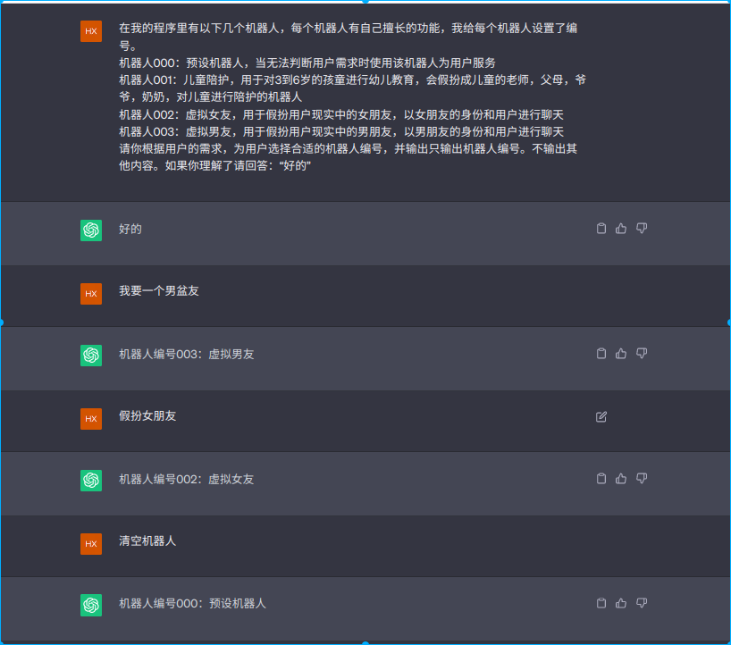

# AI焦虑症
openai的chatGPT大流行后，国内一大批国产大模型跟进，让大模型的AI成为2023最火热的技术焦点。
于是很多自媒体就开始了夸张的宣传，“你再不快点学习使用chatGPT,就要落伍了，要被淘汰了，
要被AI取代了”。“快来报名，只要699，保你精通chatGPT,送账号”。这样的氛围下，假如自己现在的工作还没有用到AI，
就感觉自己要被淘汰了，急得像热锅上的蚂蚁。大家似乎患上了一种AI焦虑症，感觉自己要被时代抛弃了。
于是赶紧掏出699购买课程，学习使用chatGPT。但是这时候会发现 ，AI并没有他们说的那么高大上。
大部分人付费学习后也就是把网上的示例试了一试。并不能在自己的工作中得到帮助。于是又开始焦虑了。
# 如何缓解AI焦虑症
我们要知道AI确实能提高人类的生产效率，只是它目前还处于初期阶段，智能不足。
我个人认为我们已经处在了另一场工业革命的初期，这次工业革命的特点是，实现了将电能转换成了智能，
这个特点意味着，它会越来越智能。你现在之所以需要花699学习怎么使用它，不过是因为它还不够智能，
但是当他足够智能的时候，就不是你要学习怎么使用它，而是它要学习怎么理解你需求了。也就是你现在学不学怎么
使用它最后它都能让你用上。那么怎么正确看待AI未来取代人类的焦虑呢？焦虑的来源其实是对某个事务的未知，
未知会让人恐惧，恐惧产生焦虑。AI范畴太大，我建议程序员先了解chatGPT,了解它的能力，掌握使用它的思想，
这样就能大大缓解未知带来的焦虑了。我现在教大家一个利用AI能力的编程思想。学会了它想象空间就很大了。这个教程不用花699，只要花5分钟理解里面的思路。
# 什么是面向AI编程
面向AI编程是一种编程思想，就是利用AI的能力来完成软件功能。
copilot等AI编程助手的出现，AI独立编程指日可待，程序员可以借助AI工具帮自己轻松完成代码编写的任务。
这里更多的是使用AI来帮助编写代码或生成代码。我这里定义的面向AI编程是指：在程序里调用AI的能力，利用AI本身的能力来完成软件功能。
## 利用AI能力示例
举个简单的例子：我最近开发一个微信公众号遇到的场景，
我后台预制了7到8个调教完美的AI机器人。每个机器人在自己领域里都非常专业，但是跨领域后
的回答就会很别扭，所有需要用户自行切换机器人。
### 程序实现机器人切换
在没有想明白怎么利用AI之前，我是这么做的：
我程序里预设了以下几个映射：
```text
0=清空机器人预置
1=儿童陪护
2=英文翻译专家
3=中文翻译专家
4=LINUX_SHELL
5=JAVASCRIPT_CONSOLE
6=女朋友
7=男朋友
8=妈妈
```
用户回复：“预置机器人:2”或“预置机器人:3”等字符串，我通过精确匹配字符串，就可以切换机器人了。
但是这种做法非常程序化，不够智能，用户体验不好。用户必须知道机器人和数字的映射关系。用户可能输入错别字
或者标点符合全角半角切换。这些都会导致程序无法识别。
### AI实现机器人切换
既然我们已经进入了AI智能时代了，当然得用更酷的方式来让用户设置机器人对吧！怎么才是最酷的呢？
当然是用更自然的聊天式语言来切换机器人了，比如用户说：“我想要一个女朋友”，“我家小宝宝需要你的陪伴”，“我想念我妈妈了”，
甚至有错别字，“我想要一个女盆友”。这些自然语言的处理如果使用程序判断，那就是天量的代码了，
但是如果利用AI。那就是很简单的一个api接口调用了。于是我使用的以下提示词完成任务：

这样我让chatgpt返回了精确的机器人编号。我通过这个编号来切换机器人。这样用户就可以自由切换机器人了而不用局限于固定的用户输入。
这里我使用了一个思想，利用chatGTP的语言理解能力，将用户的自然语言转换成程序可以理解的指令。
## 其他应用场景
以上示例里我利用了AI对信息的抽取映射能力，改变了用户和程序的交互方式。这种思想可以应用到很多场景。
我再说个使用场景：智能客服系统经常遇到一个场景，
用户可能有5到10种问法，但是他们都指向了同一个答案。没有ai的解决方式就是将这些问法都列出来，然后一一匹配到这个答案，
但是这种做法弊端很明显，就是很难枚举用户的所有问法，有时候用户输入错别字了也可能匹配不到答案。
有了ai以后，只要将部分问法和答案输入模型，ai自己就能根据已有问题和答案推断出很多相似甚至错别字的问法。
## 更多想象空间
按照这种思想进行编程，很多用户的交互方式都可以改变。我觉得大部分的web界面都可以被替换成自然语言的交互方式。
由AI识别用户的意图，然后转换成程序可以理解的指令，然后程序执行指令调用api，替代人类在界面上的鼠标点击操作。
然后将结果返回给用户。比如低代码平台需要用户在web界面各种点击编辑操作，现在可以试试通过这种思想让用户在web界面的操作变成自然语言的交互方式。
想象一下，产品人员对着对话框输入一段语音，用自然语言描述需求，如：“我需要有个页面显示最近30天用户的购买品类分布数据柱状图”。
然后AI将语音转文字后识别出用户的意图，将意图转成程序可以理解的指令，然后程序执行指令，调用低代码平台的接口，生成对应的页面，将页面
部署到测试环境，返回该页面的链接给产品人员。产品人员就可以直接在浏览器里看到自己定制的页面了，这效率得提升多少倍。
再想象一下，如果在和甲方沟通需求时，直接将需求输入对话框，几秒钟后就可以看到对应的页面了。当面和甲方确认需求，这样的沟通需求也将变成已经轻松的事。
这就是我所说的面向ai编程将带来的变革，他不是取代某个岗位，而是改变了某个岗位的工作方式，让某个岗位的工作效率提升了几十倍，几百倍。运用思想，把ai当高材生的朋友，
充分利用它的能力才是这个新时代要做的事情。
## 深入细节实现“我需要有个页面显示最近30天用户的购买品类分布数据柱状图”
其实用户很难一下子描述清楚自己的需求，而AI此时应该做更多的事情，它要充当一个产品经理，帮用户提取需求。提取完全部信息输出“已完成”
如：
```text
用户：我想查看用户购买品类的数据分布
AI：请问您需要查看什么时间段的购买数据？
用户：30天内吧
AI：请问您需要展示哪些品类的数据？
用户：所有品类
AI：请问需要使用什么方式展示数据？
用户：有哪些数据展示方式？
AI：有柱状图、折线图、饼图、雷达图、散点图、地图等
用户：我需要柱状图
AI：我在已经在这个页面生成了你要的柱状图，你可以点击这个链接查看：{***}
用户：好的，谢谢
```
这样完全可以让AI通过一步步引导，了解用户的真实意图和需求，然后转换和执行程序可以理解的指令，生成对应的页面。
有人要问怎么实现上面的AI追问？这个不需要花699买课程，这只是一个简单的提示词：
```text
你是一个管理后台的产品经理，你需要对以下“对话过程”进行分析，然后按以下要求提取以下信息，如果没有提取到指定信息则生成一句回复，引导用户说出该信息：
要求1：判断用户是否需要生成一个页面
要求2：获取用户需要展示的数据
要求3：获取用户对展示数据的要求
要求4：获取用户需要使用什么方式展示数据
对话过程：
{***}
```
这样的提示词就可以让AI自己提取信息，自己生成回复，自己引导用户说出信息。
# 总结
面向AI编程是一种思想，这种思想告诉我们，不只让AI帮你写代码，还要让AI帮你完成软件的某些功能，
不要只想着界面上几个按钮让用户点点点，而是让AI识别用户的意图，帮用户完成某些操作。
对于用户来说动嘴总比动手来得简单，这种思想需要程序员多多开发AI在程序中所能承担的角色和功能，
需要产品将人机交互的方式转换成人人交互的方式，把AI当人。

**完**